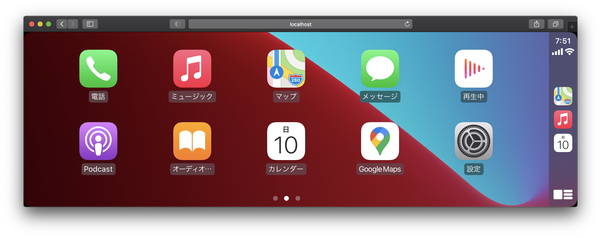

# gocarplay

CarPlay dongle library based on [pycarplay](https://github.com/electric-monk/pycarplay) written in Go.



## Compatibility

Works with following devices:

- [Carlinkit USB CarPlay Dongle Android Auto for Refit Android Screen Multimedia Player Autokit Smart Link Wired Adapter | Aliexpress](https://s.click.aliexpress.com/e/_A4YMmf)

## Demo

```
cd webrtc-demo
go run .
```

## License

[MIT](LICENSE)

